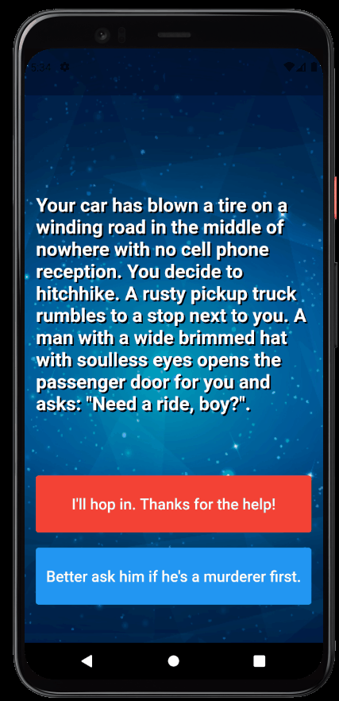
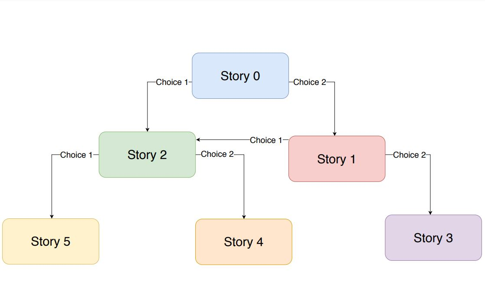

# Destini app - [](https://flutter.dev/)

<h1 align="center">
  <p>🔮Test your Destini here!🔮</p>
  
</h1>

# Story path

<h1 align="center">
  
</h1>

# Features

- Single page with a story, and you have 2 choices
- Control each path based on choice

## Getting Started

- Clone the repository
- run in cmd:
  ```cmd
  flutter pub get
  flutter run
  ```

## Dependencieis

| Lib           | Link                                                                      |
| ------------- | ------------------------------------------------------------------------- |
| Pacifico font | [Google fonts](https://fonts.google.com/specimen/Pacifico?query=pacifico) |

## Device

- Tested in Pixel 4 - Android 11
